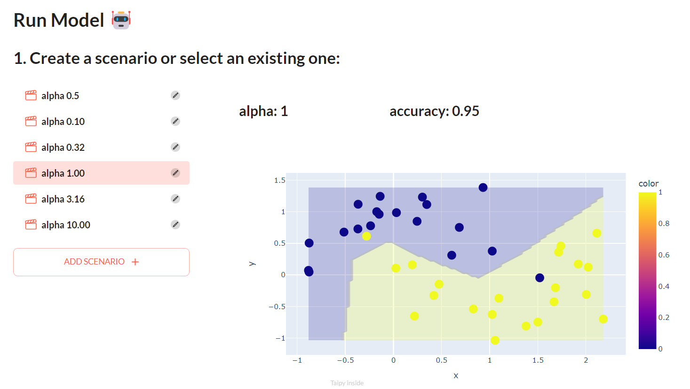

# 📊 Varying regularization in Multi-layer Perceptron

<p align="center">
  
</p>

## How to use

1. Install the requirements:
```bash
pip install -r requirements.txt
```

2. Run the script:
```bash
python main.py
```